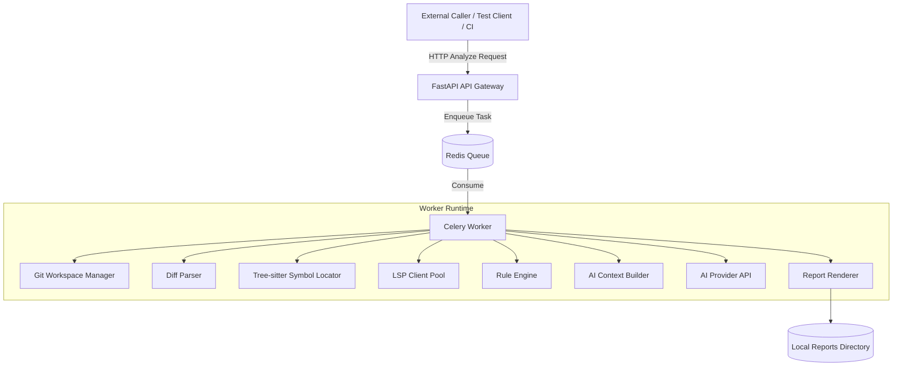
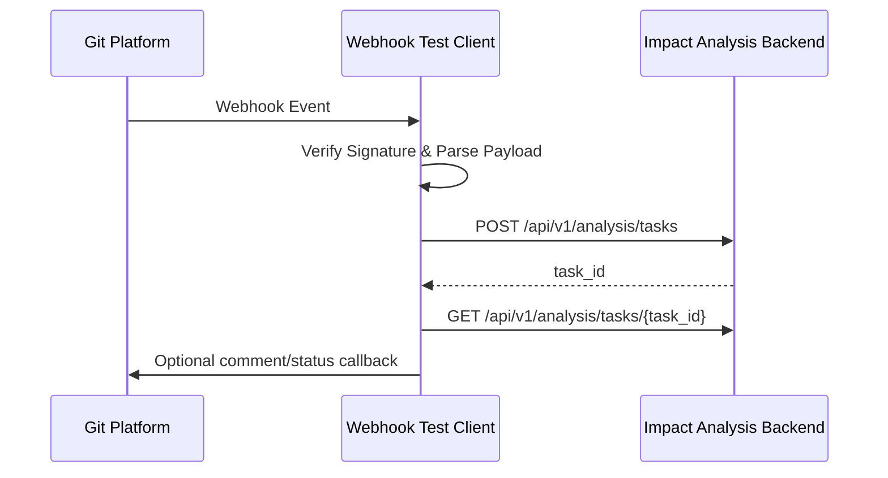

# AI 代码改动影响面分析与规范评审系统设计方案

本方案设计一个部署在 Linux 环境中的代码改动影响面分析与规范评审后台。后台本身只提供标准 HTTP API，不直接接收或解析 GitLab/GitHub Webhook。外部系统、CI 流水线或测试 client 可以在收到 Webhook 后，转换为统一的 HTTP 分析请求并发送到后台。

首期支持语言范围收敛为 **Lua、C/C++、Java、Python**。系统通过 Git 差异、Tree-sitter AST、LSP 语义能力、静态规则扫描和 AI 评审共同完成影响面分析、代码规范检查、通用开发红线判断和报告落地。

---

## 1. 目标与边界

### 1.1 目标

1. 通过 HTTP API 接收代码分析任务，返回 `task_id`，支持状态查询和报告查询。
2. 支持多个实际工程接入，每个工程可以配置仓库地址、凭证、语言、规则集、AI 参数和报告留存策略。
3. 支持 Lua、C/C++、Java、Python 的改动符号定位、调用链追踪、代码规范评审和常见陷阱识别。
4. 提供统一开发红线标准，作为 AI 评审和静态规则扫描的共同判定依据。
5. 通过 API 调用 AI 服务，具备输入输出 token 超限处理、分片、摘要、重试和结构化输出校验能力。
6. 将分析报告优先落地为本地 Markdown 文件，按项目名称、日期、分支和时间划分目录，便于快速查看和归档。

### 1.2 非目标

1. 后台不直接承接 Git 平台 Webhook，也不依赖某一个代码托管平台的 Webhook 格式。
2. 首期不支持 Go、Rust、JavaScript、TypeScript、PHP 等语言。
3. 首期不追求完整跨服务调用链，只分析当前仓库内的符号、文件、模块和入口影响。
4. AI 结论不作为唯一阻断依据；阻断结果由静态规则、红线等级、AI 置信度和项目策略共同决定。

---

## 2. 总体架构

系统采用异步任务处理架构。HTTP API 负责接收任务和查询结果，Worker 负责克隆代码、计算 diff、构建 AST/LSP 上下文、执行规则检查、调用 AI 并落地报告。



### 2.1 核心组件

1. **FastAPI API Gateway**：提供任务提交、任务状态、报告查询、项目配置查询等 HTTP 接口。
2. **测试 Client / 集成 Client**：可监听 GitLab/GitHub Webhook 或 CI 事件，将平台差异转换为后台统一 HTTP 请求。它是外部适配层，不属于后台核心入口。
3. **Git Workspace Manager**：负责仓库缓存、提交检出、隔离 worktree、diff 生成和任务目录清理。
4. **Tree-sitter Symbol Locator**：把 diff 行号映射到函数、方法、类、宏、模块等语法节点。
5. **LSP Client Pool**：按语言启动或复用 LSP 实例，查询定义、引用、调用层级、诊断信息。
6. **Rule Engine**：执行统一红线规则和语言专属规则，产出确定性检查结果。
7. **AI Context Builder**：控制上下文预算，选择 diff、调用链、规则、代码片段和摘要后组装 prompt。
8. **AI Provider Adapter**：通过 HTTP API 调用云端或内网 AI 服务，统一重试、限流、超时和结构化输出解析。
9. **Report Store**：首期将 Markdown 报告、结构化 JSON、原始 diff 和 AI 用量摘要写入本地报告目录；数据库和对象存储作为后续看板化扩展。

---

## 3. HTTP API 设计

### 3.1 提交分析任务

`POST /api/v1/analysis/tasks`

```json
{
  "project": {
    "name": "org-user-service",
    "repository_full_name": "org/user-service",
    "clone_url": "git@github.com:org/user-service.git",
    "default_branch": "main",
    "credential_ref": "github-readonly-key"
  },
  "revision": {
    "base_commit": "a1b2c3d4",
    "target_commit": "e5f6g7h8",
    "source_branch": "feature/fix-login",
    "target_branch": "main",
    "compare_mode": "base_to_head",
    "source_repo": {
      "full_name": "org/user-service",
      "clone_url": "git@github.com:org/user-service.git"
    }
  },
  "trigger": {
    "provider": "github",
    "event": "pull_request",
    "action": "synchronize",
    "delivery_id": "0c5f4f30-21d8-11ef-8f1e-2f8f6b7b9c11",
    "pr_number": 123,
    "pr_url": "https://github.com/org/user-service/pull/123",
    "sender": "developer-login"
  },
  "languages": ["lua", "cpp", "java", "python"],
  "options": {
    "max_call_depth": 2,
    "enable_ai_review": true,
    "enable_static_rules": true,
    "report_format": ["json", "markdown"]
  }
}
```

字段说明：

1. `project.clone_url` 指目标仓库，也就是 PR 的 base repository。
2. `revision.base_commit` 对应 GitHub `pull_request.base.sha`。
3. `revision.target_commit` 对应 GitHub `pull_request.head.sha`。
4. `revision.source_branch` 对应 GitHub `pull_request.head.ref`。
5. `revision.target_branch` 对应 GitHub `pull_request.base.ref`。
6. `revision.source_repo` 对应 GitHub `pull_request.head.repo`，用于 fork PR 或跨仓库 PR；如果 head repo 与 base repo 相同，可以与 `project` 相同。
7. `trigger.delivery_id` 对应请求头 `X-GitHub-Delivery`，用于任务幂等和排查重复投递。
8. `trigger.action` 只建议首期处理 `opened`、`synchronize`、`reopened`，其他 action 默认忽略。

返回：

```json
{
  "task_id": "task_20260603_000001",
  "status": "PENDING",
  "status_url": "/api/v1/analysis/tasks/task_20260603_000001"
}
```

### 3.2 查询任务状态

`GET /api/v1/analysis/tasks/{task_id}`

```json
{
  "task_id": "task_20260603_000001",
  "project_name": "org-user-service",
  "status": "RUNNING",
  "stage": "AI_REVIEW",
  "progress": 72,
  "trigger": {
    "provider": "github",
    "event": "pull_request",
    "pr_number": 123,
    "delivery_id": "0c5f4f30-21d8-11ef-8f1e-2f8f6b7b9c11"
  },
  "idempotency_key": "github:0c5f4f30-21d8-11ef-8f1e-2f8f6b7b9c11",
  "report_dir": "reports/org-user-service/2026-06-03/pr-123-feature-fix-login-102500",
  "started_at": "2026-06-03T10:20:30Z",
  "updated_at": "2026-06-03T10:22:10Z"
}
```

### 3.3 查询报告

`GET /api/v1/analysis/tasks/{task_id}/report`

支持通过 `?format=json` 或 `?format=markdown` 获取结构化报告或 Markdown 报告。

---

## 4. Webhook 测试 Client 设计

后台不直接处理 Webhook。为了方便测试和集成，可以提供独立 client：



Client 的职责：

1. 解析 GitLab/GitHub/Gitee 等平台的事件格式。
2. 校验平台 Webhook 签名。
3. 从事件中提取 `project.name`、`base_commit`、`target_commit`、分支和仓库信息。
4. 调用后台统一 HTTP API。
5. 可选地把后台报告回填到 Git 平台评论或 CI 状态。

这样后台保持平台无关，测试 client 和实际接入 client 可以按企业环境分别实现。

---

## 5. 核心分析流程

### 5.1 任务状态机

```text
PENDING
  -> CHECKOUT
  -> DIFF_PARSE
  -> SYMBOL_LOCATE
  -> IMPACT_ANALYSIS
  -> STATIC_RULE_REVIEW
  -> AI_REVIEW
  -> REPORT_RENDER
  -> SUCCESS
```

异常状态：

```text
FAILED
CANCELLED
TIMEOUT
AI_LIMIT_EXCEEDED
```

### 5.2 工作区隔离

每个任务使用独立 worktree 或临时目录，避免多任务互相污染。

1. 为每个仓库维护 bare mirror 缓存。
2. 每个任务基于 `target_commit` 创建隔离 worktree。
3. diff 通过 `git diff base_commit target_commit` 生成。
4. LSP 实例绑定到任务 worktree 或只读 revision，不在运行中直接 `git pull` 修改工作区。
5. 任务结束后按策略保留或清理工作区。

### 5.3 行号到符号定位

1. 从 diff 提取新增、修改和删除行。
2. 使用 Tree-sitter 解析目标文件。
3. 将改动行映射到最小封闭语法节点，例如函数、方法、类、宏、模块级代码块。
4. 若改动仅为注释、空行或纯格式化，标记为 `LOW_IMPACT_CANDIDATE`，仍保留可配置的 AI 抽检能力。

### 5.4 调用链追踪

默认追踪 2 层上游调用：

1. Level 0：被修改的符号。
2. Level 1：直接调用或引用 Level 0 的符号。
3. Level 2：调用或引用 Level 1 的上游入口。

不同语言的 LSP 覆盖率不同，报告中必须标注：

1. `confidence`：HIGH、MEDIUM、LOW。
2. `source`：LSP、Tree-sitter、static-reference、heuristic。
3. `limitations`：例如动态调用、反射、宏展开、字符串 require、运行时注册等无法完全追踪的情况。

---

## 6. 首期语言支持矩阵

| 语言 | Tree-sitter | LSP / 语义工具 | 静态规则工具 | 重点限制 |
| :--- | :--- | :--- | :--- | :--- |
| Lua | tree-sitter-lua | lua-language-server | luacheck, selene | 字符串动态 require、全局表注册、运行时 monkey patch 难以完整追踪 |
| C/C++ | tree-sitter-c, tree-sitter-cpp | clangd | clang-tidy, cppcheck | 宏展开、条件编译、模板实例化、编译数据库缺失会影响准确率 |
| Java | tree-sitter-java | eclipse.jdt.ls | SpotBugs, PMD, Checkstyle | 反射、Spring 动态注入、AOP、运行时代理需要降级标注 |
| Python | tree-sitter-python | pyright 或 jedi-language-server | ruff, bandit, mypy | 动态导入、猴子补丁、运行时属性注入难以完整追踪 |

---

## 7. 语言专属代码规范与常见陷阱

这些规则既用于静态规则检查，也会被注入 AI prompt，要求 AI 在解释时引用具体规则来源。

### 7.1 Lua

**代码规范评审标准**

1. 模块必须显式返回 table，避免污染 `_G`。
2. 变量默认使用 `local`，禁止无意创建全局变量。
3. Table 字段访问要对可能为 nil 的中间节点做保护。
4. 错误处理要明确，禁止吞掉 `pcall` 返回错误。
5. 公共模块函数命名要表达业务语义，避免匿名函数层层嵌套。

**常见代码陷阱**

1. 未声明 `local` 导致全局变量泄漏。
2. `require` 路径由外部输入拼接，导致加载非预期模块。
3. 使用 `load`、`loadstring` 执行未校验输入。
4. `ipairs` 遇到 nil 中断导致数组遍历不完整。
5. 深层 table 访问触发 nil reference。

### 7.2 C/C++

**代码规范评审标准**

1. 禁止使用 `gets`、`strcpy`、`sprintf` 等不安全函数。
2. C++ 优先使用 RAII、智能指针和容器管理资源。
3. 所有外部输入参与内存分配、数组访问、格式化输出前必须做边界校验。
4. 头文件要避免循环依赖，公共接口变更需评估 ABI/API 兼容性。
5. 多线程共享数据必须明确锁、原子变量或不可变数据策略。

**常见代码陷阱**

1. 缓冲区溢出、越界读写。
2. use-after-free、double free、内存泄漏。
3. `printf(user_input)` 形式的格式化字符串漏洞。
4. 整数溢出后参与内存分配或边界判断。
5. 宏副作用、条件编译导致不同平台行为不一致。

### 7.3 Java

**代码规范评审标准**

1. 外部输入进入 SQL、文件路径、命令执行、反序列化前必须校验和参数化。
2. IO、数据库连接、流对象必须使用 try-with-resources 或等效释放方式。
3. 异常处理必须包含上下文日志或向上抛出，禁止只 `printStackTrace`。
4. 公共 API、DTO、数据库 Schema 变更必须说明兼容策略。
5. 并发集合、线程池、异步任务必须有容量、超时和关闭策略。

**常见代码陷阱**

1. MyBatis `${}` 或字符串拼接 SQL。
2. `ObjectInputStream` 反序列化不可信数据。
3. 路径穿越，直接使用用户输入拼接文件路径。
4. Spring AOP、反射、动态代理导致静态调用链不完整。
5. 线程池无界队列或任务未设置超时导致资源耗尽。

### 7.4 Python

**代码规范评审标准**

1. 禁止对未校验输入使用 `eval`、`exec`、`pickle.loads`。
2. 文件、网络、数据库资源必须使用上下文管理器或显式释放。
3. 核心 API、公共函数和复杂数据结构应提供类型注解。
4. 异常处理必须保留上下文，禁止裸 `except` 后静默忽略。
5. 对外部命令、路径、SQL、模板渲染必须做注入风险检查。

**常见代码陷阱**

1. 函数默认参数使用 `[]`、`{}` 等可变对象。
2. 动态 import 或 monkey patch 导致调用链难以追踪。
3. f-string 拼接 SQL 或 shell 命令。
4. 协程创建后未 await，任务泄漏或异常丢失。
5. 日志输出 token、密码、手机号、身份证等敏感数据。

---

## 8. 统一开发红线评审标准

统一红线适用于所有项目和所有首期语言。红线规则默认不可由仓库本地配置豁免，只能由系统管理员在全局策略中调整。

| 分类 | 红线 | 判定标准 | 默认等级 |
| :--- | :--- | :--- | :--- |
| 凭证安全 | 禁止硬编码敏感凭证 | 代码、配置、测试数据中出现明文密码、Token、API Key、私钥、证书口令 | CRITICAL |
| 注入风险 | 禁止直接拼接执行型语句 | SQL、Shell、模板、路径、Lua/Python 动态执行内容由外部输入拼接 | CRITICAL |
| 隐私保护 | 禁止日志泄露敏感信息 | 日志输出密码、完整手机号、身份证、银行卡、Token、Cookie、Session | CRITICAL |
| 错误暴露 | 禁止对外返回底层错误细节 | API 响应暴露堆栈、SQL 错误、文件路径、内部服务地址 | CRITICAL |
| 兼容性 | 禁止无迁移策略的破坏性变更 | 公共 API 字段删除、类型变更、数据库字段删除或语义改变未提供过渡方案 | CRITICAL |
| 资源控制 | 必须设置超时与资源上限 | 网络请求、数据库查询、线程池、协程、外部命令缺少超时或上限 | WARNING |
| 异常处理 | 禁止吞错 | 空 catch、裸 except 后无日志无抛出、忽略关键返回值 | WARNING |
| 性能风险 | 禁止循环内阻塞式外部调用 | 循环中同步 SQL、HTTP、文件 IO，且无批量化或并发控制 | WARNING |

---

## 9. 规则配置与动态规范导入

每个项目可在后台管理配置和仓库本地 `.review-config.yaml` 中声明规则。合并优先级如下：

1. 企业全局红线：最高优先级，默认不可豁免。
2. 项目级规则：由后台项目配置维护。
3. 仓库本地规则：由仓库 `.review-config.yaml` 提供，仅能增加规则或豁免非红线规则。

示例：

```yaml
version: "1.0"
project:
  languages: ["lua", "cpp", "java", "python"]
rules:
  redline_documents:
    - "docs/security/redlines.md"
  style_documents:
    - "docs/coding-style/java.md"
    - "docs/coding-style/python.md"
  custom_rules:
    - id: "PY001"
      language: "python"
      severity: "WARNING"
      description: "核心 service 层函数必须带类型注解"
ai:
  max_input_tokens: 120000
  max_output_tokens: 8000
  chunk_strategy: "by_file_and_symbol"
```

安全约束：

1. 仓库本地配置只允许引用仓库内相对路径。
2. 后台全局配置才允许引用系统规则目录。
3. 规则文档解析后必须生成稳定 `rule_id`，报告中按 `rule_id` 追溯。
4. AI 输出必须引用规则来源；无法引用来源的结论标记为 `AI_SUGGESTION`，不直接作为红线违规。

---

## 10. AI API 调用与超限处理

### 10.1 AI Provider 适配

系统通过 HTTP API 调用 AI 服务，支持 OpenAI-compatible、本地 vLLM、Ollama 兼容接口或企业内部模型网关。

```python
class AIProvider:
    def review(self, request: AIReviewRequest) -> AIReviewResponse:
        """发送结构化评审请求，返回结构化评审结果。"""
```

调用要求：

1. 设置连接超时、读取超时和总超时。
2. 支持 429、5xx、网络失败的指数退避重试。
3. 支持并发限流和项目级配额。
4. 所有请求和响应都记录 token 用量、模型名称、耗时、截断状态和 trace id。

### 10.2 输入超限处理

AI Context Builder 必须在调用前估算 token：

1. 优先保留统一红线、语言规则、diff 摘要、改动符号、直接调用链和高风险静态扫描结果。
2. 大文件按符号切片，只保留改动符号及其调用上下文。
3. 多文件变更按风险排序分批评审。
4. 调用链节点过多时保留入口、直接调用者和高风险路径，其余写入摘要。
5. 若单次请求仍超限，拆分为多个 AI review chunk，再做 final aggregation。

### 10.3 输出超限处理

1. 要求 AI 输出 JSON，字段数量固定，避免长篇自由文本。
2. 每个 chunk 限制最多返回 N 条发现，按严重等级排序。
3. 若输出被截断，自动要求模型续写剩余 JSON 片段，或重试为更小 chunk。
4. 对 AI 输出做 JSON Schema 校验，失败则进入修复 prompt；连续失败后降级为人工待审。
5. final report 聚合时去重同一文件、同一行、同一规则的重复发现。

### 10.4 Prompt 输入结构

AI 输入分为固定区域和可裁剪区域：

```text
固定区域：
- 系统角色和输出 JSON Schema
- 统一开发红线
- 当前语言专属规则
- 项目自定义规则

可裁剪区域：
- Diff 片段
- 改动符号代码
- Level 1 / Level 2 调用链代码
- 静态扫描结果
- 项目背景摘要
```

---

## 11. 报告输出与落地

### 11.1 结构化 JSON

```json
{
  "schema_version": "1.0",
  "task_id": "task_20260603_000001",
  "project_name": "user-service",
  "meta": {
    "repository": "git.example.com/team/user-service",
    "base_commit": "a1b2c3d4",
    "target_commit": "e5f6g7h8",
    "languages": ["python", "java"],
    "analyzed_at": "2026-06-03T10:25:00Z"
  },
  "verdict": {
    "risk_level": "HIGH",
    "blocking": true,
    "risk_score": 86,
    "critical_count": 1,
    "warning_count": 3
  },
  "findings": [
    {
      "id": "finding_001",
      "file": "src/user/service.py",
      "line": 48,
      "language": "python",
      "severity": "CRITICAL",
      "category": "InjectionRisk",
      "rule_id": "REDLINE-INJECTION-001",
      "rule_source": "global:redlines.md#禁止直接拼接执行型语句",
      "source_engine": ["bandit", "ai"],
      "confidence": "HIGH",
      "message": "用户输入被拼接进 SQL 字符串，存在 SQL 注入风险。",
      "suggestion": "改为参数化查询，并为异常输入补充测试。",
      "evidence": {
        "code_excerpt": "sql = f\"select * from users where name = '{name}'\"",
        "impact_symbols": ["get_user_by_name"]
      },
      "dedupe_key": "src/user/service.py:48:REDLINE-INJECTION-001"
    }
  ],
  "impact_tree": [
    {
      "modified_symbol": "get_user_by_name",
      "file": "src/user/service.py",
      "confidence": "MEDIUM",
      "level_1_callers": [
        {
          "symbol": "login",
          "file": "src/api/login.py",
          "risk": "HIGH"
        }
      ]
    }
  ],
  "ai_usage": {
    "provider": "internal-openai-compatible",
    "model": "qwen-coder",
    "input_tokens": 62000,
    "output_tokens": 4200,
    "chunk_count": 3,
    "truncated": false
  },
  "artifacts": {
    "report_dir": "reports/org-user-service/2026-06-03/pr-123-feature-fix-login-102500",
    "markdown_report": "reports/org-user-service/2026-06-03/pr-123-feature-fix-login-102500/review.md",
    "json_report": "reports/org-user-service/2026-06-03/pr-123-feature-fix-login-102500/report.json",
    "diff_patch": "reports/org-user-service/2026-06-03/pr-123-feature-fix-login-102500/diff.patch"
  }
}
```

### 11.2 Markdown 报告

Markdown 报告用于人工阅读，包含：

1. 总体风险结论。
2. 阻断项和非阻断项汇总。
3. 影响面树。
4. 红线违规和语言规范问题表。
5. AI 置信度和分析限制说明。
6. 推荐测试点。
7. 报告链接和任务元信息。

### 11.3 报告落地策略

首期不引入数据库和对象存储，先使用本地文件目录作为唯一报告落地方式。这样部署简单，也更适合先验证分析质量和报告格式。

目录规则：

```text
reports/
  {project_name}/
    {YYYY-MM-DD}/
      {pr_number_optional}{safe_branch_name}-{HHmmss}/
        review.md
        report.json
        diff.patch
        ai-usage.json
        static-findings.json
```

示例：

```text
reports/
  org-user-service/
    2026-06-03/
      pr-123-feature-fix-login-102500/
        review.md
        report.json
        diff.patch
        ai-usage.json
        static-findings.json
```

命名规则：

1. `project_name` 使用后台请求中的项目名称，写入路径前需要做安全化处理，只保留字母、数字、点、横线和下划线。
2. 日期使用分析任务开始日期，格式为 `YYYY-MM-DD`。
3. 如果请求来自 GitHub PR，目录名前缀加入 `pr-{number}-`，例如 `pr-123-`。
4. 分支名需要转换为安全路径，例如 `feature/fix-login` 转成 `feature-fix-login`。
5. 时间使用任务开始时间，格式为 `HHmmss`。
6. 如果同一秒内出现重复任务，在目录后追加短 task id，例如 `pr-123-feature-fix-login-102500-task001`。

文件说明：

1. `review.md`：主报告，给人阅读，作为首期最重要的产物。
2. `report.json`：与 Markdown 对应的结构化报告，方便后续脚本二次处理。
3. `diff.patch`：原始 diff，便于复盘分析上下文。
4. `ai-usage.json`：记录模型、输入输出 token、分片数、是否截断。
5. `static-findings.json`：记录静态规则工具产出的原始发现。

后续当需要查询看板、趋势统计、跨项目检索和权限管理时，再引入 PostgreSQL 和对象存储，把本地目录中的 `report.json` 作为迁移数据源。

---

## 12. 多项目管理与本地报告目录设计

### 12.1 项目识别

HTTP 请求中需要包含项目名称：

```json
{
  "project": {
    "name": "user-service",
    "clone_url": "git@git.example.com:team/user-service.git"
  }
}
```

首期可以不维护数据库项目表，项目名称由请求方传入。后台只负责对 `project.name` 做路径安全化，并用它创建报告目录。

### 12.2 本地任务元数据

为了支持任务状态查询，可以在本地维护轻量任务元数据文件：

```text
runtime/
  tasks/
    {task_id}.json
```

任务元数据包含：

```json
{
  "task_id": "task_20260603_000001",
  "project_name": "user-service",
  "status": "SUCCESS",
  "stage": "REPORT_RENDER",
  "base_commit": "a1b2c3d4",
  "target_commit": "e5f6g7h8",
  "branch": "feature/fix-login",
  "report_dir": "reports/user-service/2026-06-03/feature-fix-login-102500",
  "created_at": "2026-06-03T10:25:00Z",
  "updated_at": "2026-06-03T10:28:30Z"
}
```

### 12.3 留存策略

1. 本地报告目录默认保留 30 天。
2. main、release 分支可配置更长留存期，例如 180 天。
3. 清理任务只删除本地报告目录和对应 runtime task 元数据。
4. 若后续需要长期审计，可把整份报告目录打包归档到共享盘或对象存储。

---

## 13. 安全与权限

1. HTTP API 使用服务 Token 或 mTLS 鉴权。
2. 每个项目只能访问自己绑定的仓库凭证和报告。
3. clone URL 必须做 allowlist 校验，防止 SSRF。
4. 仓库本地规则文件路径必须限制在仓库目录内。
5. Worker 运行在受限用户下，任务目录隔离，限制 CPU、内存、磁盘和执行时间。
6. 凭证使用 KMS 或主密钥加密存储，定期轮换。
7. 报告中的敏感内容需要脱敏，尤其是 diff、AI 输入输出和错误日志。

---

## 14. 部署方案

首期建议使用容器化部署：

1. `impact-api`：FastAPI HTTP 服务。
2. `impact-worker`：Celery Worker。
3. `redis`：任务队列。
4. `reports-volume`：挂载本地报告目录，例如 `/data/impact-reports`。
5. `runtime-volume`：挂载本地任务状态目录，例如 `/data/impact-runtime`。
6. `ai-gateway`：可选，统一代理云端或内网 AI 服务。

在全离线环境中，需要提前准备：

1. Python wheel 包。
2. Node.js 和 LSP server 包。
3. Tree-sitter grammar 预编译包。
4. clangd、lua-language-server、eclipse.jdt.ls、pyright 等语言工具。
5. 静态规则工具和规则包。
6. 本地 AI 模型权重或内网 AI 网关。

---

## 15. 实施路线图

### Phase 1：MVP 基础链路

1. HTTP API 任务提交、状态查询、报告查询。
2. 基于项目名称创建本地报告目录。
3. Git worktree 隔离和 diff 解析。
4. Python 与 Lua 的 Tree-sitter 行号到符号定位。
5. 基础 Markdown 和 JSON 报告落地。

### Phase 2：语言分析能力

1. 接入 C/C++ clangd、clang-tidy、cppcheck。
2. 接入 Java eclipse.jdt.ls、SpotBugs、PMD。
3. 接入 Python pyright、ruff、bandit。
4. 接入 Lua lua-language-server、luacheck、selene。
5. 实现 Level 1 / Level 2 调用链追踪和置信度标注。

### Phase 3：AI 评审与超限治理

1. AI Provider Adapter。
2. Context Builder token 预算控制。
3. 分片评审和聚合评审。
4. JSON Schema 校验和输出修复。
5. AI 用量记录和项目级配额。

### Phase 4：多项目与报告生命周期

1. 项目配置文件或后台 API。
2. 规则集管理。
3. 本地报告历史查询。
4. 本地报告目录生命周期清理。
5. 测试 client 支持 Webhook 转 HTTP 分析请求。

---

## 16. 关键风险与应对

| 风险 | 影响 | 应对 |
| :--- | :--- | :--- |
| LSP 对动态语言或复杂工程覆盖不足 | 影响面漏报 | 报告标注置信度，结合静态引用和 AI 补充解释 |
| AI 输入超限 | 分析失败或上下文丢失 | token 预算、分片、摘要、风险排序 |
| AI 输出不稳定 | 报告无法解析 | 固定 JSON Schema、校验、修复 prompt、失败降级 |
| 多项目并发导致工作区污染 | 结果不可信 | bare repo 缓存 + 独立 worktree + 任务幂等 |
| 规则过多导致误报 | 开发体验下降 | 规则分级、置信度、项目级非红线豁免 |
| 报告包含敏感代码 | 合规风险 | 本地目录权限、脱敏、可配置关闭 AI 原文落地 |
